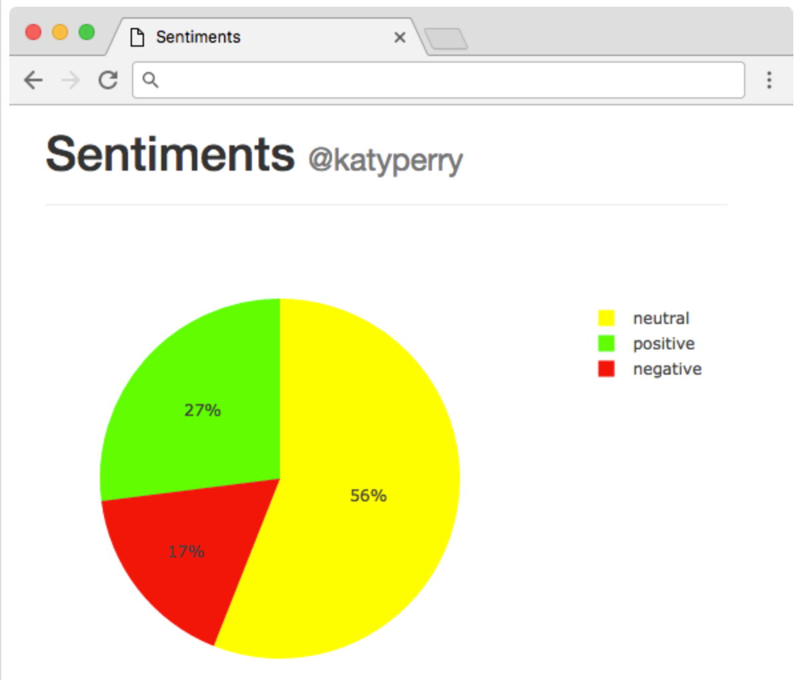

# The programs in pset6 are as follow:

1. Implement the program mario.c exactly as specified from previous pset but in python

2. Implement the program greedy.c exactly as specified from previous pset but in python

3. Implement the program caesar.c exactly as specified from previous pset but in python

4. Implement a program that categorizes a word as positive or negative:
```
$ ./smile love
:) [in green text]
$ ./smile hate
:( [in red text]
$ ./smile Stanford
:| [in yellow text]
```

5. Implement a program that categorizes a user’s tweets as positive or negative:
```
$ ./tweets @cs50
 0 hello, @world [in yellow text]
 1 I love you, @world  [in green text]
-1 I hate you, @world [in red text]
```

6. Implement a website that generates a pie chart categorizing a user’s tweets:

