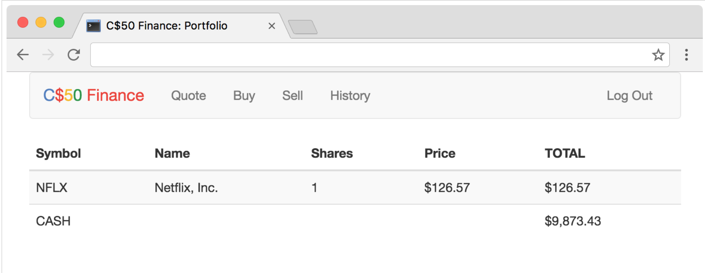

# The program in pset7 is as follow:

1. Implement a website via which users can "buy" and "sell" stocks, a la the below:

To run:

Instal flask
set the environment: export FLASK_APP=application.py
flask run